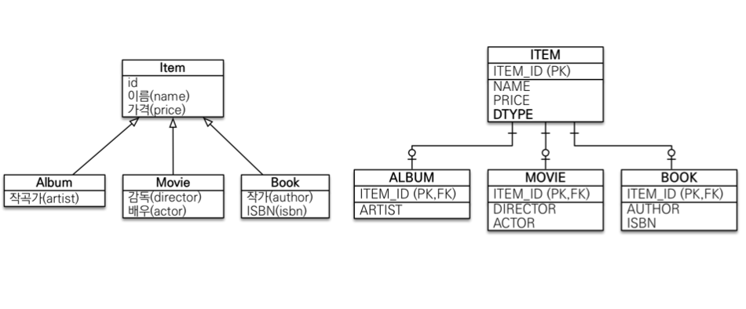
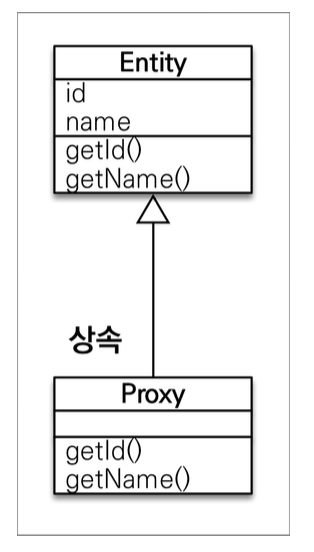
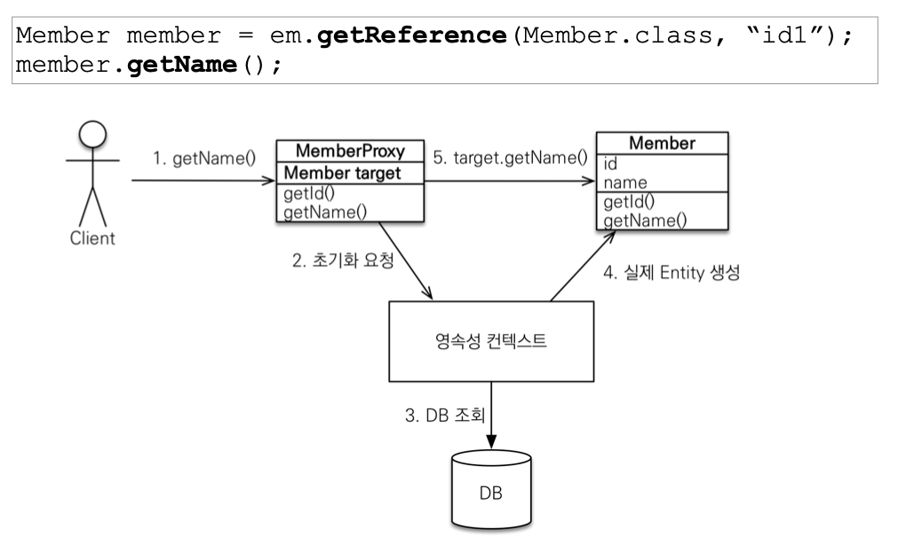
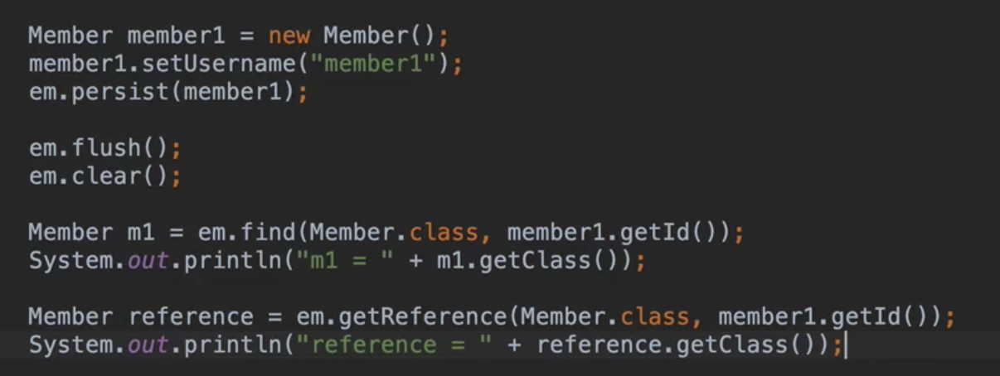

## 다양한 연관관계 매핑

### 연관관계 매핑 시 고려해야할 점

	1. 다중성
 	2. 단방향, 양방향
 	3. 연관관계 주인 


### 1. 다중성

- 다대일 : @ManyToOne
- 일대다 : @OneToMany
- 일대일 : @OneToOne
- 다대다 : @ManyToMany (실무에서는 거의 쓰면 안된다)

### 2. 단방향, 양방향

**테이블**

- 외래 키 하나로 양쪽 조인 가능, 방향 개념이 없다

**객체**

- 참조용 필드가 있는 쪽으로만 참조 가능
- 한쪽만 참조하면 단방향 / 양쪽 다 참조하면 양방향

### 3. 연관관계 주인 

**테이블**

- 외래키 하나로 두 테이블이 연관관계 가짐

**객체**

- 양방향은 두 객체 모두 참조를 2개 가지고 있다(A→B , B→A)
- 둘 중 테이블의 외래키를 관리할 곳을 지정해야 한다
  - **연관관계 주인** : 외래키 관리하는 참조 (@JoinColumn)
  - **주인의 반대편** : 외래키에 영향을 주지않고, 단순 조회만 가능 (mappedBy)

- 일대다 단방향 매핑보다는 다대일 양방향 매핑을 사용하자
  - '다' 쪽이 연관관계 주인이어야 설계, 운영 편리

- @JoinColumn을 꼭 사용해야 함. 
  - 그렇지 않으면 조인 테이블 방식을 사용해서 Team_Member와 같은 중간 테이블을 추가하게 된다 


### 일대일 관계

- 일대일 관계는 반대도 동일
- 둘 중 아무쪽이든 외래 키 선택 가능
- 외래키에 DB 유니크 제약조건이 자동으로 추가됨


- 대상 테이블 외래키 단방향은 JPA 지원 X (양방향만 지원)

> ？ **주 테이블과 대상 테이블 판단 기준?** 
>
> 자주 호출되는 쪽이 주 테이블?


**주 테이블에 외래키**

- 주 객체가 대상 객체의 참조를 가지는 것처럼, 주 테이블에 외래 키를 두고 대상 테이블을 찾음
- 객체지향 개발자 선호 • JPA 매핑 편리

장점(+) : 주 테이블만 조회해도 대상 테이블에 데이터가 있는지 확인 가능

단점(-) : 값이 없으면 외래 키에 null 허용

> ？ **값이 없으면 외래키에 null 허용, 대상 테이블일 경우 아닌가?** 
>
> 대상 테이블은 주테이블이 있을 때만 존재하는 느낌? 예를 들면 Member가 존재하지 않으면 그 아래 Locker도 존재하지 않는 느낌 - 그럼 대상 테이블이 외래키를 가지고있으면 상대적으로 FK가 null이 될 상황이 많이 없어지겠지? 그렇군

**대상 테이블에 외래키**

- 대상 테이블에 외래 키가 존재
- 전통적인 데이터베이스 개발자 선호

장점(+) : 주 테이블과 대상 테이블을 일대일에서 일대다 관계로 변경할 때 테이블 구조 유지 단점(-) : 프록시 기능의 한계로 **지연 로딩으로 설정해도 항상 즉시 로딩됨**(프록시는 뒤에서 설명)


### 다대일 관계

### ManyToMany 대신 OneToMany와 ManyToOne으로!

- 연결 테이블용 엔티티 추가(연결 테이블을 엔티티로 승격! 더 이상 숨겨진 테이블이 아니다!)


```java
public class Member{
	  // ...
		@OneToMany(mappedBy = "products") // 🍎🍎
		private List<MemberProdcut> memberProducts = new ArrayList<>();
}

@Entity
public class MemberProdcut{
	  // ...
		@ManyToOne
		@JoinTable(name = "MEMBER_ID") // 🍎🍎
		private Member member;

		@ManyToOne
		@JoinTable(name = "PRODUCT_ID") // 🍏🍏
		private Product product; 

    // 중간 테이블에 매핑 정보 이외의 다른 정보들도 추가할 수 있다
		private int count;
		private int price;

		private LocalDateTime orderDateTime;
}

@Entity
public class Locker {
	  // ...
		@OneToMany(mappedBy = "product") // 🍏🍏
		private List<MemberProdcut> memberProducts = new ArrayList<>();
}
```


## 고급 매핑

### 상속관계 매핑

### 매핑 전략 공통

- @DescriminatorColumn(name = "DTYPE")  // 👈👈 부모 테이블에 "DTYPE"이라는 이름으로 구분 칼럼 추가

  - 자식 테이블 구분을 위한 칼럼
  - 운영 측면에서 넣어주는 것이 좋다, DB 측면에서는 Item 데이터가 어떤 데이터를 위해서 들어왔는지 모르기 때문에

  

- @DescriminatorValue("M")

  - Dtype 컬럼에 들어가는 값 설정
  - 따로 지정하지 않으면 엔티티 이름을 사용한다
  - ex) Movie 엔티티는 "Movie"

### 1. 조인 전략 매핑

- @Inheritance(strategy = InheritanceType.JOINED) // 👈👈 조인 전략
- 

**장점**

- 테이블 정규화
- 외래 키 참조 무결성 제약조건 활용가능
- 저장공간 효율화 (정규화되어있기 때문)

**단점**

- 조회시 조인을 많이 사용, 성능저하(생각보다 효율성이 크게 떨어지진 않는다)
- 조회 쿼리가 복잡함 (관리하는 테이블이 다른 전략에 비해 많다보니!)
- 데이터 저장시 INSERT SQL 2번 호출 (생각보다 효율성 차이가 크게 없다)

→ 기본적으로 조인 전략을 택하는게 좋다, 객체 지향 관점에서도 잘 맞는 전략(설계 측면에서 굿), 정규화 가능


### 2. 단일 테이블 전략

- @Inheritance(strategy = InheritanceType.SINGLE_TABLE) // 👈👈 디폴트 값이므로 생략 가능


- @DescriminatorColumn(name = "DTYPE") 설정 하지 않더라도 자동으로 생성
  - 구분 컬럼이 꼭 필요하기 때문

**장점**

- 조인이 필요 없으므로 일반적으로 조회 성능이 빠름
- 조인이 필요 없기 때문에 조회 쿼리가 단순하고 성능이 빠르다 (한 테이블만 보면 된다)

**단점**

- 자식 엔티티가 매핑한 컬럼은 모두 null 허용
  - 데이터 무결성 측면에서는 노놉
- 단일 테이블에 모든 것을 저장하므로 테이블이 커질 수 있다.
- 상황에 따라서 조회 성능이 오히려 느려질 수 있다.

> 무결성 제약 조건 중 **개체 무결성**!!  기본키는 null 값이 될 수 없음


### 3. 구현 클래스마다 테이블 전략

**장점**

- 서브 타입을 명확하게 구분해서 처리할 때 효과적
- not null 제약조건 사용 가능

**단점**

- 여러 자식 테이블을 함께 조회할 때 성능이 느림(UNION SQL 필요)

- 자식 테이블을 통합해서 쿼리하기 어려움

  - 변경 관점에서 안좋다
  - 새로운 타입이 추가될 때 코드를 많이 뜯어고쳐야 한다

  

### 조인 전략 VS 단일 테이블 전략

- 데이터가 단순하고 확장할 일도 없다

  → 단일 테이블 전략

- 그게 아니라 비즈니스적으로 중요하고 복잡하다

  → 조인 전략


### @MappedSuperclass

- 테이블과 관계 없고, **단순히 엔티티가 공통으로 사용하는 매핑 정보를 모으는 역할**
- 상속관계 매핑X / 엔티티X / 테이블과 매핑X
- 부모 클래스를 상속 받는 **자식 클래스에 매핑 정보만 제공**
- 조회, 검색 불가(**em.find(BaseEntity) 불가**)직접 생성해서 사용할 일이 없으므로 **추상 클래스 권장**

```java
@MappedSuperClass
public abstract class BaseEntity {
		@Id @GeneratedValue
		private Long id;
		
		private String name;
		private LocalDateTime createdDate;
}

@Entity
public class Member extends BaseEntity {
		
		// id, name, createdDate 상속

		private String email;
}
```


## 프록시와 연관관계 관리

### 프록시 객체란

실제 객체 대신에 데이터베이스 조회를 지연할 수 있는 가짜 객체


### 프록시가 왜 필요한가?

예를 들어 아래와 같이 회원과 팀 엔티티가 존재한다

```java
@Entity
public class Member {
		// ...
		@ManyToOne
		private Team team;

}

@Entity
public class Team {
		// ...
}
```

그리고 주요 비즈니스 로직에서 Member 객체만 조회하는 경우가 많을 땐?

### em.find() vs em.getReference()

- em.find() : 데이터베이스를 통해 실제 엔티티 객체 조회

- em.getReference() : 데이터베이스 조회를 미루는 가짜(프록시) 엔티티 객체 조회

  

### 프록시 특징

- 실제 클래스를 상속 받아 만들어짐
- 실제 클래스와 겉 모양이 같다
- 사용하는 입장에서는 프록시인지 진짜 객체인지 구분하지 않고도 사용 가능




### 프록시 특징

- 실제 객체의 참조(target)를 보관

- 프록시 객체의 초기화

   : 프록시 객체를 호출하면 프록시는 실제 객체의 메소드 호출

  - 예를 들면 member.getName()을 호출할 경우 그제서야 데이터베이스를 조회해서 실제 엔티티 객체를 생성


### 프록시 객체의 초기화

```java
// 프록시 객체 조회
Member member = em.getReference(Member.class, memberId);
// 프록시 객체 초기화 (만약 프록시 객체의 target이 null일 경우)
member.getName();
```




### 프록시 객체 특징

- 처음 사용 시 한 번만 초기화

- 프록시 객체를 통해 실제 엔티티에 '접근'할 수 있다(참조를 보관하기 때문)

- 프록시 객체는 원본 엔티티를 상속받은 객체이기 때문에 타입 체크시 유의해야 함

  - == 비교 대신 instanceof 를 사용하자

  ```java
  Member member1 = em.find(Member.class, memberId1);
  Member member2 = em.getReference(Member.class, memberId2);
  
  // == 비교 
  member1 == member2; // false
  
  // 예시에서는 getReference로 프록시를 가져오긴 했지만 em.find()로 조회했을 때도 프록시를 가져올 가능성이 있기 때문에 주의해야 함
  
  // instanceof 비교
  member1 instanceof Member; // true
  member2 instanceof Member; // true
  ```

- DB를 조회할 필요가 없기 때문에

 

- em.find()를 통해 해당 엔티티가 영속성 컨텍스트에 등록이 되어있다면, 이후 getReference()를 호출하더라도 실제 엔티티 반환

1. [최적화 측면 이점] 이미 1차 캐시로 실제 엔티티 가져올 수 있는데 굳이 프록시로 가져올 필요 없다
2. [일관성 이점] JPA는 원래 한 트랜젝션 안에 있는 같은 엔티티 객체는 같다는 것을 보장해 주어야 함

- 일관성 이점에 대한 부연 설명
  - JPA는 == 비교하는 같은 객체에 대해 같다고 응답해야 함
  - 아래 코드에서 첫 번째로 getReference()로 조회해 프록시를 가져오게 되면, 두 번째로 find()를 하더라도 아래 == 을 맞춰주기 위해서 find()도 프록시 객체를 가져온다


- 준영속상태의 프록시를 초기화하면 문제가 발생
  - 프록시 객체는 초기화시에, 영속성 컨텍스트를 통해 실제 Entity를 가져오는데 프록시 객체가 영속성 컨텍스트가 준영속상태일 경우 초기화가 불가능


### 지연 로딩

- 지연 로딩(Lazy)을 사용해 프록시로 조회

```java
@ManyToOne(fetch = FetchType.LAZY) // 👈👈
@JoinColumn(name = "TEAM_ID")
private Team team;
..
```

```java
Member member = em.find(Member.class, memberId); // 프록시 조회
Team team = member.getTeam();
team.getName(); // 실제 team을 사용하는 시점에 프록시 초기화(DB 조회) 이루어 짐
```


### 즉시로딩 피해야 하는 이유

- 예상치 못한 SQL 발생

하나의 엔티티에 연관된 엔티티가 여러 개라면.. JOIN이 N번 나간다.. 성능상 문제가 된다

- 즉시 로딩은 JPQL에서 N+1 문제 발생
  - 예를 들어 select m from Member m" 이라는 JPQL을 실행하면, Member 객체를 가져오고서 Eager를 딱 보고 엇.. Team도 가져와야하네 뒤늦게 인지를 하고 Team을 조회하기 위한 select 쿼리를 한 번 더 날린다. 멤버 객체가 N개라면 이와 관련된 Team 조회 쿼리가 N번 나간다

→ @ManyToOne, @OneToOne은 기본이 즉시 로딩이므로 지연 로딩 설정을 꼭 해주자

→ @OneToMany, @ManyToMany는 디폴트가 지연로딩이므로 오케이

- 한 번에 가져오고 싶다면 즉시로딩(EAGER) 대신 **JPQL fetch 조인이나, 엔티티 그래프 기능을 사용**해라!


### Cascade : 영속성 전이

- 특정 엔티티를 영속 상태로 만들 때 연관된 엔티티도 함께 영속 상태로 만들고 싶을 때
- 연관관계 매핑, Lazy 로딩 아무 관련 없다
- 엔티티를 persist할 때 해당 엔티티 아래 cascade 적용된 애들(연관된 엔티티)도 같이 persist 날려줄거야

#### Cascade가 없다면

- persist를 여러번 호출해주어야 한다

#### CASCADE의 종류

- **ALL:** 모두 적용
- **PERSIST:** 영속
- **REMOVE:** 삭제
- **MERGE**: 병합
- **REFRESH**: REFRESH
- **DETACH**: DETACH


### 언제 사용할까?

- Cascade 사용하자
  - 단일 엔티티에 대해 종속적일 경우만
  - 소유자가 하나일 때만
  - parent와 child의 라이프 사이클이 같을 때만
- 예를 들어, 게시판과 첨부파일 관계처럼, 첨부파일이 게시판 엔티티에서만 관리할 때는 가능!
- 근데 만약 첨부파일이 다른 엔티티와도 연관되어 있다면 cascade 사용하지 말자


### 고아 객체

- 고아 객체 제거 : 부모 엔티티와 연관관계가 끊어진 자식 엔티티를 자동으로 삭제
- orphanRemoval = true

```java
Parent parent1 = em.find(Parent.class, id); 
parent1.getChildren().remove(0);
//자식 엔티티를 컬렉션에서 제거
// 자동으로 DELETE FROM CHILD WHERE ID=? 쿼리가 날아간다.
```

- 참조가 제거된 엔티티는 다른 곳에서 참조하지 않는 고아 객체로 보고 삭제하기 때문에 참조하는 곳이 하나일 때, 단일 엔티티에 종속적일 때만 사용해야 한다.
- @OneToOne, @OneToMany 에서만 사용 가능
- 개념적으로 부모를 제거하면 자식은 고아가 된다. 따라서 고아 객체 제거 기능을 활성화 하면, 부모를 제거할 때 자식도 함께 제거된다. 이것은 CascadeType.REMOVE처럼 동작한다.

> **Cascade.REMOVE와 orphanRemoval = true 설정 차이?**
>
> CascadeType.Remove 와 orphanRemoval = true 의 차이점은 관계가 끊어졌을 때 데이터에 대한 동작의 차이
>
> - orphanRemoval : 부모 객체 (Parent)와 자식 객체(Child)의 관계가 끊어졌을 때, 자식 객체의 데이터까지 삭제
> - CascadeType.Remove : 참조가 변경 또는 삭제되어도 고아객체가 삭제되지 않는다.
>
> 참고 : https://circlee7.medium.com/jpa-cascade-remove-vs-orphan-removal-c246e6a76c10


### 영속성 전이 + 고아 객체, 생명주기

- 스스로 생명주기를 관리하는 엔티티는 em.persist()로 영속화, em.remove()로 제거
- BUT, 두 옵션을 모두 활성화 하면 부모 엔티티를 통해서 자식의 생명 주기를 관리할 수 있음
  - CascadeType.ALL + orphanRemovel=true
- 도메인 주도 설계(DDD)의 Aggregate Root 개념을 구현할 때 유용