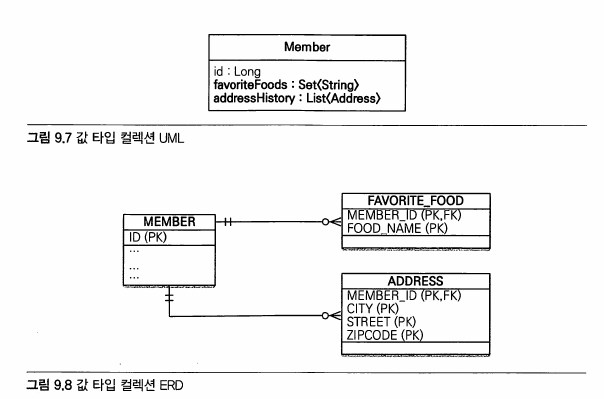
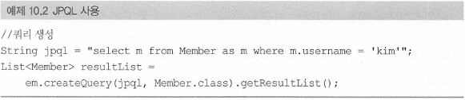
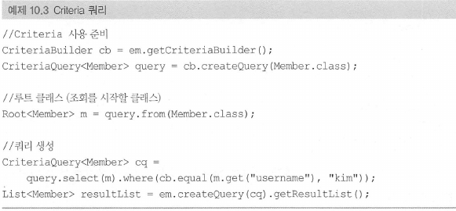
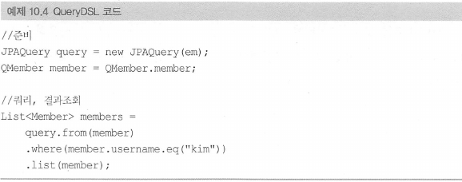

# 09. 값 타입


## 값 타입

- (비유) 단순한 수치 정보
- 복잡한 객체 세상을 조금이라도 단순화하려고 만든 개념
- 식별자가 없다.
- 생명 주기를 엔티티에 의존
- 공유하지 않는 것이 안전하며, 가능한 `불변`으로 설계해야함.
- 종류
  - `기본값 타입(primitive type, wrapper class, String)`, `임베디드 타입`, `컬렉션 값 타입`

---

### 값 타입이 불변이 아닐 경우 생길 수 있는 문제

- `값 타입`을 여러 엔티티에서 공유한다고 할때, 변경시 사이드 이펙트 발생 가능성 존재
- 복사해서 사용하면 공유 참조를 피할 수 있음
  - 문제는 복사하지 않고 원본의 참조 값을 직접 넘기는 것을 막을 방법이 없음
- 근본적인 해결책
  - 불변으로 만들기
    - 인스턴스의 참조 값 공유를 피할 수 는 없지만, 참조 값을 공유해도 인스턴스 값을 수정할 수 없으므로 부작용이 발생하지 않음

---


## 값 타입 컬렉션

- 값 타입을 하나 이상 저장하려면 컬렉션에 보관
- RDB의 테이블은 컬럼안에 컬렉션을 포함할 수 없음
  - 아래 `그림 9.8` 처럼 별도의 테이블을 추가해야함



- 자바 ORM 표준 JPA 프로그래밍 - 335p

  

- 사용예시

  ```java
  @Entity
  public class Member{
  ...
  
  @ElementCollection
  @CollectionTable(name = "FABORITE_FOOD",
    joinColumn = @JoinColumn(name = "MEMBER_ID"))
  @Column(name = "FOOD_NAME")
  private Set<String> favoriteFoods = new HashSet<String>();
  
  
  @ElementCollection
  @CollectionTable(name = "ADDRESS",
    joinColumn = @JoinColumn(name = "MEMBER_ID"))
  private List<Address> addressHistory = new ArrayList<Address>();
  
  ...
  }
  ```

  

## 값 타입 컬렉션의 제약사항

>  값 타입은 식별자가 없음, 단순한 값들의 모음
>
> 값을 변경해버리면 데이터베이스에 저장된 원본 데이터를 찾기 어려움 (❓️❓️❓️)

1. JPA 구현체들은 값 타입 컬렉션에 변경 사항이 발생하면, 
   - 값 타입 컬렉션이 매핑된 테이블의 연관된 모든 데이터를 삭제하고, 
     - 현재 값 타입 컬렉션 객체에 있는 모든 값을 데이터베이스에 다시 저장
     - 이러한 이유로 실무에서는 값 타입 컬렉션이 매핑된 테이블에 데이터가 많다면 `일대다 관계`를 고려해야함

2. 값 타입 컬렉션을 매핑하는 테이블은 모든 컬럼을 묶어서 기본키를 구성해야 함
   1. 기본 키 제약 조건으로 인해 컬럼에 null 입력 ❌
   2. 같은 값 중복 저장 ❌


- 위 문제를 모두 해결하려면, 값 타입 컬렉션 대신에 

  - `일대다 관계 설정` + `영속성 전이(Cascade)` + `고아 객체 제거(ORPHAN REMOVE) 기능`을 적용

    

---

# 10. 객체지향 쿼리 언어


>  ORM을 사용하면 데이터베이스 테이블이 아닌 엔티티 객체를 대상으로 개발하므로 검색도 테이블이 아닌 엔티티 객체를 대상으로 하는 방법이 필요함
>
> 이런 문제를 해결하기 위해 `JPQL`이 만들어짐
>
> - SQL
>   - 데이터베이스 테이블을 대상으로 하는 데이터 중심의 쿼리
>
> - JPQL(Java Persistence Query Language)
>   - 엔티티 객체 대상으로 하는 `객체지향 쿼리`
>   - JPA는 JPQL을 분석한 다음 적절한 SQL을 만들어 데이터베이스를 조회
>   - JPQL 빌더 클래스
>     - `Criteria`, `QueryDSL`


### JPQL



- 자바 ORM 표준 JPA 프로그래밍 - 348p

  

- SQL을 추상화해서 특정 데이터베이스에 의존하지 않음

- SQL 보다 간결하다.

  - 엔티티 직접조회, 묵시적 조인, 다형성 지원

  

### Criteria



- 자바 ORM 표준 JPA 프로그래밍 - 350p

  

- 문자가 아닌 프로그래밍 코드로 `JPQL`을 작성할 수 있음

- 장점

  - 컴파일 시점에 오류를 발견할 수 있음
  - IDE 자동완성 지원
  - 동적 쿼리 작성 편리

- 단점

  - 모든 장점을 상쇄할 정도로 복잡하고 장황함

  

### QueryDSL



- 자바 ORM 표준 JPA 프로그래밍 - 351p

  

- Criteria 처럼 JPQL 빌더 역할

- 코드 기반이면서 단순하고 사용하기 쉬움

- 어노테이션 프로세서를 사용해서 쿼리 전용 클래스를 만들어야함 (QMember는 Member 엔티티 클래스 기반으로 생성)


### 네이티브 SQL

- JPA예 SQL 직접 사용
- 특정 데이터베이스에 의존하는 기능을 사용해야할 때 사용
- SQL은 지원하지만 JPQL이 지원하지 않는 기능을 사용할 때 사용

- 단점
  - 데이터베이스를 변경하면 네이티브 SQL도 수정해야함


---


## JPQL


- 대소문자 구분
  - 엔티티와 속성은 대소문자 구분
  - JPQL 키워드(SELECT, FROM..)은 대소문자를 구분하지 않는다.
- 엔티티 이름
  - JPQL에서 사용하는 FROM 뒤에 오는 건 엔티티명
- 별칭 필수


### 파라미터 바인딩

- 선택이 아닌 `필수`

- 파라미터 바인딩을 사용하지 않고 직접 문자를 더해 만들어 넣으면 악의적인 사용자에 의해 `SQL 인젝션 공격`을 당할 수 있음

  `"SELECT m FROM Member m WHERE m.username =  ' " + usernameParam + " '  "`

- 파라미터 바인딩 방식을 사용하면 애플리케이션과 데이터베이스 모두 해당 쿼리의 파싱 결과를 `재사용`할 수 있어서 전체 성능이 향상됨


### 프로젝션

- SELECT 절에 조회할 대상을 지정하는 것
- 프로젝션 대상
  - 엔티티 / 임베디드 타입 / 기본 데이터 타입
- 임베디드 타입 프로젝션
  - 임베디드 타입은 조회의 시작점이 될 수 없는 제약 존재
  - 임베디드 타입은 값 타입, 즉 영속성 컨텍스트에서 관리되지 않음

- NEW 명령어

  - 조회할 때 특정 필드만 프로젝션할 경우 타입을 지정할 수 없음

    - 원하는 객체에 맵핑하는 작업은 지루함

  - SELECT 다음에 new 명령어를 사용하면 반환 받을 클래스의 생성자에 JPQL 조회 결과를 넘겨줄 수 있음

    ```java
    TypedQuery<UserDTO> query = 
       em.createQuery("SELECT new jpabook.jpql.UserDTO(m.username, m.age) FROM Member m", UserDTO.class);
       
    List<UserDTO> resultList = query.getResultList();
    ```

  - 주의

    - 패키지 명을 포함한 전체 클래스 명 (`FQDN`)을 입력해야 한다.
    - 순서와 타입이 일치하는 생성자가 필요하다.

  

### 페이징 API

- 데이터베이스마다 페이칭 처리 SQL문법이 다름

- JPA는 페이징을 두 API로 추상화

  - setFirstResult(int startPosition) : 조회 시작 위치(0부터 시작)
  - setMaxResults(int maxResult) : 조회할 데이터 수

- 페이징 SQL을 더 최적화 하고 싶다면 `네이티브 SQL`을 사용해야함.

  

### JPQL 조인

- SQL 조인과 기능은 같고 문법만 약간 다르다.
- JPQL은 다른 엔티티와 연관관계를 가지기 위해 사용하는 필드인, 연관 필드(`m.team`)를 사용
  - `Member m JOIN m.team t;`
  - 연관 필드를 사용하지 않고, SQL 조인처럼 사용하면 문법 오류가 발생함


**세타 조인(Theta Join)**

> 조인에 참여하는 두 릴레이션의 속성 **값**을 비교하여 조건을 만족하는 투플만 반환한다.
> 세타조인의 조건은{=,≠,≥,≤,>,<} 중 하나가 된다.

- 세타 조인은 내부 조인만 지원한다.


### 페치 조인

- JPQL에서 성능 최적화를 위해 제공하는 기능
- 연관된 엔티티나 컬렉션을 한 번에 같이 조회하는 기능
- 일반적인 JPQL 조인과는 다르게 페치 조인은 별칭을 사용할 수 없다.
  - 👋 하이버네이트는 페치 조인에도 별칭을 허용


### 페치 조인과 일반 조인의 차이

- JPQL은 결과를 반환할 때 연관관계까지 고려하지 않음
- 단지 SELECT 절에 지정한 엔티티만 조회


### 페치 조인의 특징

- 페치 조인을 사용하면 SQL 한 번으로 연관된 엔티티들을 함께 조회할 수 있어서 SQL 호출 횟수를 줄여 성능을 최적화 할 수 있음
- 페치 조인은 글로벌 로딩 전략보다 우선한다.
  - `@OneToMany(fetch = FetchType.LAZY) // 글로벌 로딩 전략`

- 글로벌 로딩 전략을 될 수 있으면 `지연 로딩`을 사용하고 최적화가 필요하면 `페치 조인`을 적용하는 것이 효과적

- 페치 조인을 사용하면 연관된 엔티티를 쿼리 시점에 조회 하므로 `지연 로딩`이 발생하지 않는다.
  - 준영속 상태에서도 객체 그래프를 탐색할 수 있음


### 페치 조인의 한계

- 페치 조인 대상에 별칭을 줄 수 없음
- 둘 이상의 컬렉션을 페치할 수 없음
- 컬렉션을 페치 조인하면 `페이징 API`를 사용할 수 없음


### 페치 조인 정리

- 페치 조인은 객체 그래프를 유지할 때 사용하면 효과적
- 여러 테이블을 조인해서, 엔티티 가진 모양의 다른 결과를 내야한다면, 여러 테이블에서 필요한 필드만 조회해서 DTO로 반환하는게 더 효과적 


`315p~382p`


---


### Refrence.

- https://spidyweb.tistory.com/149
- 자바 ORM 표준 JPA 프로그래밍 - 김영한